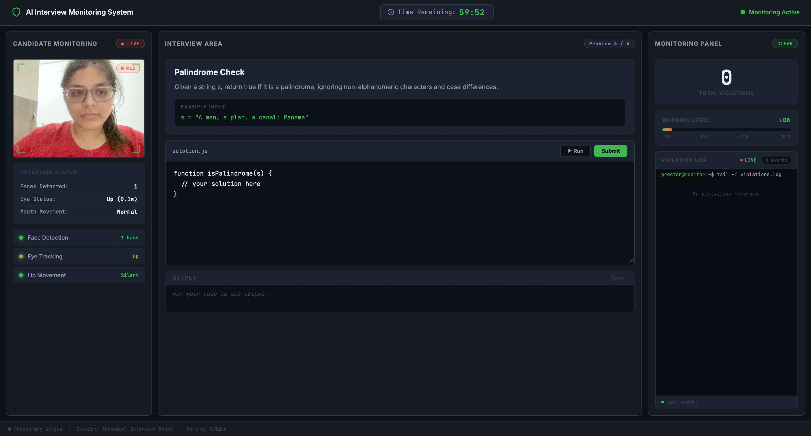
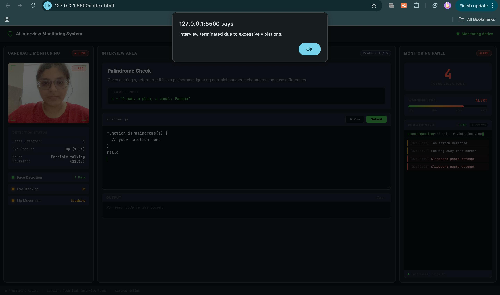

# AI Interview Monitoring System

A browser-based monitoring system designed to detect suspicious behaviour during remote technical interviews.

This project demonstrates how computer vision and browser event monitoring can be combined to improve the fairness of online assessments. The system runs entirely in the browser and continuously analyzes candidate behaviour using webcam video and browser activity signals.

Instead of relying on opaque machine learning models, the system focuses on **transparent, explainable detection logic** built on top of facial landmark analysis and rule-based reasoning.

---

# Project Motivation

Remote interviews are now widely used in hiring pipelines, but ensuring assessment integrity remains challenging.

Candidates may unintentionally or intentionally:

* switch tabs to search for answers
* copy/paste code
* consult another person off-screen
* frequently look away from the screen
* talk to someone outside the camera frame

This project explores how a lightweight monitoring system can detect such behaviours in real time using browser APIs and facial landmark analysis.

---

# Key Features

## Webcam Monitoring

The system captures the candidate’s webcam feed using the **WebRTC `getUserMedia` API**.

Video frames are continuously processed to analyze facial behaviour.

---

## Face Detection

Using **MediaPipe FaceMesh**, the system identifies faces in the webcam frame.

If more than one face is detected, a violation is triggered.

Example:

```
Faces detected: 2
Violation: Multiple people detected
```

---

## Eye Movement Detection

Eye gaze direction is estimated using iris position relative to eye corner landmarks.

The system monitors whether the candidate is looking:

* at the screen
* left
* right
* up
* down

If the candidate looks away from the screen continuously for **more than 5 seconds**, a violation is recorded.

---

## Lip Movement Detection

Lip activity is analyzed using the **Mouth Aspect Ratio (MAR)** derived from MediaPipe facial landmarks.

```
MAR = distance(upper_lip, lower_lip) / distance(left_corner, right_corner)
```

To reduce false positives, the system requires:

* MAR smoothing using a sliding window
* multiple open-close oscillations
* continuous movement for **10 seconds**
* gaze direction away from the screen

This helps distinguish **actual speaking behaviour** from natural facial expressions.

---

## Tab Switching Detection

The Page Visibility API is used to detect when the candidate switches browser tabs or minimizes the interview window.

Example event:

```
Violation detected: Tab switch
```

---

## Clipboard Blocking

The system prevents the following actions during the interview:

* copy
* paste
* cut
* right-click context menu

Attempts to perform these actions are logged as violations.

---

## Violation Management

All suspicious behaviours are processed by a central **Violation Manager**.

Violation thresholds:

```
1–2 violations → Warning
3–4 violations → Alert
5+ violations → Interview termination
```

Each violation is recorded in a timeline log.

Example:

```
[12:03:21] Tab switch detected
[12:04:12] Clipboard usage attempt
[12:05:30] Multiple faces detected
```

---

# Screenshots

## Monitoring Dashboard


## Violation Detection


---

# System Architecture

```
Webcam Feed
      │
      ▼
MediaPipe FaceMesh
      │
      ▼
Facial Landmark Detection
      │
      ▼
Behaviour Analysis
   ├─ Face detection
   ├─ Eye gaze tracking
   └─ Lip movement analysis
      │
      ▼
Violation Manager
      │
      ▼
Monitoring Dashboard
```

---

# Project Structure

```
ai-interview-monitoring-system
│
├── ai
│   ├── faceDetection.js
│   ├── eyeTracking.js
│   └── lipMovement.js
│
├── core
│   └── violationManager.js
│
├── monitoring
│   ├── tabMonitor.js
│   └── clipboardMonitor.js
│
├── index.html
├── script.js
└── style.css
```

---

# Technologies Used

Frontend

* HTML
* CSS
* JavaScript

Computer Vision

* MediaPipe FaceMesh

Browser APIs

* WebRTC (`getUserMedia`)
* Page Visibility API
* Clipboard event listeners

---

# How to Run

Clone the repository

```
git clone https://github.com/Mitali-A13/ai-interview-monitoring-system.git
```

Navigate to the project directory.

Open the application by launching:

```
index.html
```

Allow webcam access when prompted.

The monitoring system will start automatically.

---

# Design Philosophy

This project prioritizes **explainability over black-box AI models**.

All monitoring decisions are based on interpretable signals such as:

* facial landmark geometry
* time-based thresholds
* behavioural correlations

This makes the system easier to debug, audit, and extend.

---

# Possible Future Improvements

* head pose estimation
* voice activity detection
* screen recording
* behavioural anomaly scoring
* multi-camera verification

---

# Author

Developed by **Mitali Awasthi** as part of a technical assignment exploring AI-assisted interview monitoring systems.

---

# Original Assignment Brief

[](https://classroom.github.com/a/exDom1tE)
[](https://classroom.github.com/online_ide?assignment_repo_id=23149553&assignment_repo_type=AssignmentRepo)
# AI-Powered Interview Monitoring System

## Overview

In this assignment you will build an **AI-powered interview monitoring system** that detects suspicious behavior during an online interview.

The goal is to simulate a **technical interview proctoring platform** that prevents cheating during coding interviews.

The system must monitor the candidate using the webcam and browser events and generate violations if suspicious behavior occurs.

This assignment is part of the **Vertex Buddy AI Hiring Platform**.

---

# Problem Statement

Online technical interviews often suffer from cheating or external assistance.

Your task is to build a **browser-based AI monitoring system** that detects potential cheating behaviors.

The system must detect:

• Tab switching
• Copy / paste attempts
• Multiple faces in camera
• Eye movement away from screen
• Lip movement (possible talking to someone)
• Remote access or window switching

The system should maintain a **violation counter** and terminate the interview after exceeding the allowed limit.

---

# Requirements

You must implement the following features.

### 1. Webcam Monitoring

Capture webcam video using browser APIs and display the camera feed on the interview screen.

### 2. Tab Switch Detection

Detect when the user switches browser tabs or minimizes the window.

Hint:
Use the browser `visibilitychange` event.

### 3. Clipboard Blocking

Prevent copy, paste, and cut operations inside the interview page.

### 4. Face Detection

Detect how many faces are present in the camera feed.

Rules:

* Exactly **1 face allowed**
* If **0 or more than 1 face**, generate a violation.

You may use libraries such as TensorFlow.js or MediaPipe.

### 5. Eye Movement Detection

Detect if the candidate repeatedly looks away from the screen.

If the candidate looks away for more than **5 seconds**, trigger a violation.

### 6. Lip Movement Detection

Detect if the candidate is talking continuously during the interview.

Talking for a prolonged period may indicate external help.

### 7. Violation Engine

Create a rule engine that tracks violations.

Example rules:

* Max tab switches: 3
* Max eye movement warnings: 5
* Max face violations: 2

If violations exceed the limit, terminate the interview.

---

# Expected UI

The interview screen should display:

Camera Feed
Violation Counter
Eye Tracking Status
Face Count
Interview Timer

Example layout:

Camera Feed

Violations: 1 / 3
Faces Detected: 1
Eye Direction: Center

---

# Technologies You May Use

React
Browser APIs
TensorFlow.js
MediaPipe

External AI APIs such as Gemini or OpenAI are **not allowed** for detection logic.

---

# Folder Structure

src
ai-engine
faceDetection.js
eyeTracking.js
lipMovement.js
violationEngine.js

monitoring
tabMonitor.js
clipboardBlock.js
windowMonitor.js

components
CameraFeed.jsx
ViolationCounter.jsx
InterviewScreen.jsx

utils
rules.js

---

# Evaluation Criteria

Face Detection – 20 points
Eye Tracking – 20 points
Tab Monitoring – 15 points
Violation Engine – 15 points
UI / UX – 10 points
Code Quality – 10 points
Documentation – 10 points

Total: 100 points

---

# Submission Instructions

1. Implement the required features.
2. Commit your changes to the repository.
3. Push your final solution to GitHub.
